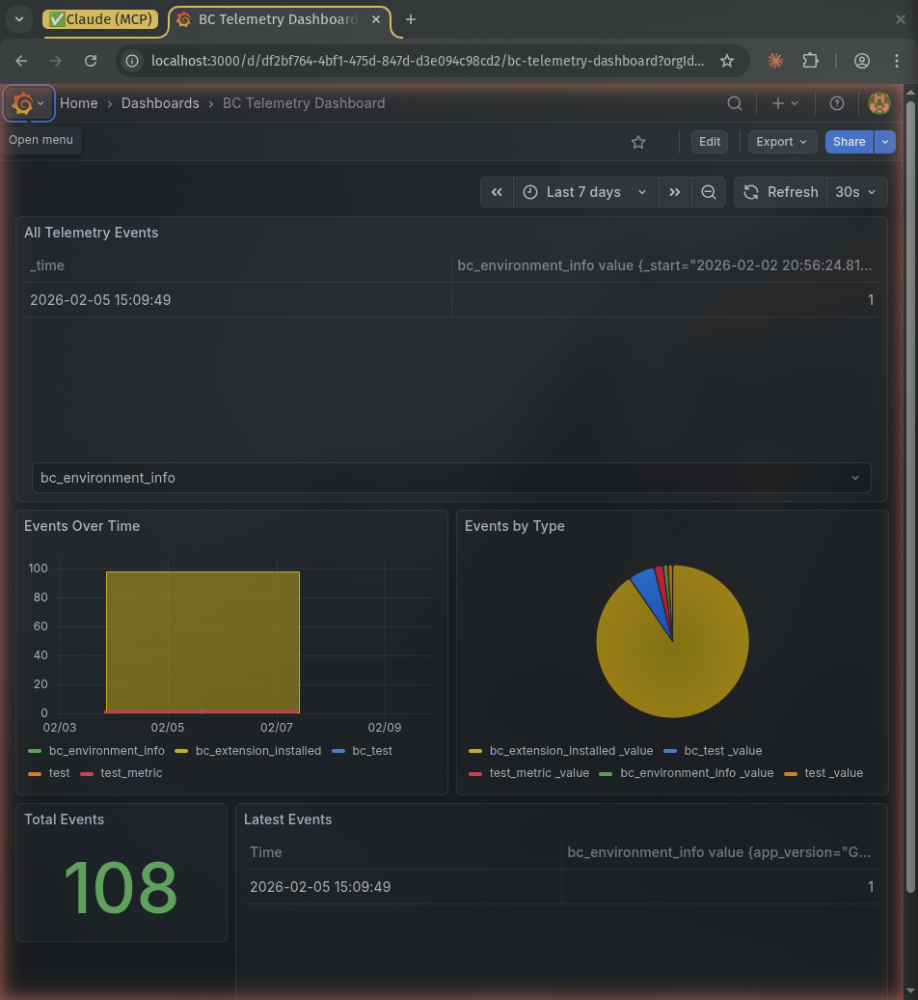
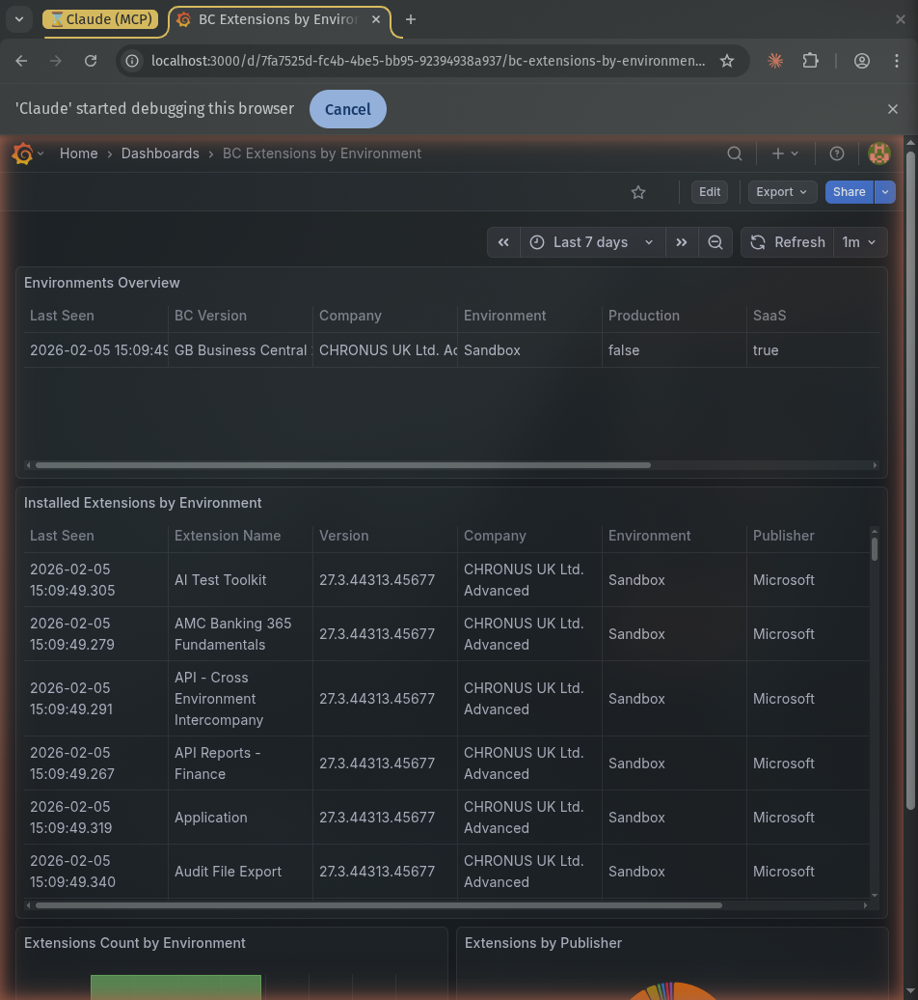

# BC Grafana Telemetry

> **PROOF OF CONCEPT (POC)** - This extension is a proof of concept and is **not production-tested**. It demonstrates the feasibility of sending Business Central telemetry data to Grafana via InfluxDB line protocol. Use at your own risk in production environments. There are no guarantees of stability, performance, or completeness.

A Business Central extension that collects telemetry events (user logins, installed extensions, environment info, errors) and sends them to Grafana Cloud or a self-hosted Grafana/InfluxDB stack using InfluxDB line protocol.

## Architecture

```
Business Central  -->  Telemetry Log (buffer table)  -->  InfluxDB (line protocol over HTTP)  -->  Grafana Dashboards
                       ^                                    ^
                       |                                    |
                  Job Queue Entry                     Token Auth (HTTPS)
                  (configurable interval)
```

**Data flow:**
1. Event subscribers capture telemetry events (logins, extensions, errors)
2. Events are buffered in a log entry table with InfluxDB-compatible timestamps
3. A Job Queue Entry periodically builds an InfluxDB line protocol payload
4. The payload is sent to Grafana/InfluxDB via authenticated HTTPS POST
5. Sent entries are cleaned up after 7 days

## Features

- **User Login Tracking** - Records who logged in, from which company, on which environment
- **Extension Inventory** - Periodic snapshots of all installed extensions with version info
- **Environment Info** - SaaS/OnPrem, Production/Sandbox status, BC version
- **Error Tracking** - Captures errors with automatic classification (Permission, Locking, Timeout, Connection)
- **Secure API Key Storage** - Uses BC IsolatedStorage with masked input
- **Job Queue Scheduling** - Configurable send interval (1-1440 minutes)
- **InfluxDB Line Protocol** - Native format for Grafana Cloud and self-hosted InfluxDB
- **Debug Tools** - Extensive debug actions for troubleshooting connectivity and payload issues

## Grafana Dashboards

Example Grafana dashboard JSON files are provided in the [`examples/grafana-dashboards/`](examples/grafana-dashboards/) directory. Import them into your Grafana instance via **Dashboards > Import** and select the JSON file.

### BC Telemetry Dashboard

Overview of all telemetry events with time-series charts, event type breakdown, and a live event feed.



### BC Extensions by Environment

Inventory of installed extensions across environments, with counts by environment and publisher breakdown.



## Setup

### Prerequisites

- Business Central 27.0 or later (runtime 16.0)
- A Grafana Cloud account **or** self-hosted Grafana + InfluxDB stack
- An InfluxDB write endpoint URL and API token

### Installation

1. Build and deploy the extension to your Business Central environment
2. Search for **Telemetry Setup** in Business Central
3. Configure the connection:
   - **Grafana Endpoint**: Your InfluxDB write URL (e.g., `https://influx-prod-xx.grafana.net/api/v1/push/influx/write`)
   - **User ID**: Your Grafana Cloud Metrics Instance ID (optional for self-hosted InfluxDB with token auth)
   - **API Key**: Click "Set API Key" and enter your InfluxDB API token or Grafana Cloud Access Token
4. Enable tracking options as needed
5. Click **Test Connection** to verify connectivity
6. Toggle **Telemetry Enabled** to start collecting and sending data

### Grafana Cloud Setup

1. Sign up at [grafana.com](https://grafana.com)
2. Navigate to your stack > **Connections** > **InfluxDB**
3. Note your write endpoint URL, Instance ID, and generate an API token
4. Enter these in the BC Telemetry Setup page

### Self-Hosted Setup

1. Install Grafana and InfluxDB (v2)
2. Create an organisation and bucket in InfluxDB
3. Generate an API token with write permissions
4. Configure the endpoint as: `https://your-host:8086/api/v2/write?org=your-org&bucket=your-bucket&precision=ns`
5. Add InfluxDB as a data source in Grafana

## Object Reference

| Type | ID | Name | Description |
|------|-----|------|-------------|
| Table | 50100 | BJF Telemetry Setup | Singleton configuration table |
| Table | 50101 | BJF Telemetry Log Entry | Telemetry event buffer/queue |
| Enum | 50100 | BJF Telemetry Type | Event type classification |
| Codeunit | 50100 | BJF Grafana Http Client | HTTP client with auth handling |
| Codeunit | 50101 | BJF Telemetry Collector | Telemetry capture and payload building |
| Codeunit | 50102 | BJF Telemetry Event Subs | System event subscribers |
| Codeunit | 50103 | BJF Telemetry Scheduler | Job Queue processing and scheduling |
| Page | 50100 | BJF Telemetry Setup | Configuration card page |
| Page | 50101 | BJF Telemetry Log Entries | Log entry list page |
| Page | 50102 | BJF API Key Dialog | Secure API key input dialog |
| PermissionSet | 50100 | BJF Telemetry | Full access permission set |

**Object ID Range:** 50100-50149

## Metrics Reference

All metrics use InfluxDB line protocol format: `metric_name,label1=value1 value=N timestamp_ns`

| Metric | Labels |
|--------|--------|
| `bc_user_login` | environment, tenant_id, company, user, is_saas, is_production, app_version |
| `bc_extension_installed` | environment, tenant_id, company, app_id, app_name, app_version, publisher |
| `bc_environment_info` | environment, tenant_id, company, is_saas, is_production, is_sandbox, app_version |
| `bc_error` | environment, tenant_id, company, source, error_hash, error_type, app_version |
| `bc_test` | environment, tenant_id, company, is_saas, is_production, test_type, app_version |

## Debug Actions

The Setup page includes several debug actions for troubleshooting:

| Action | Description |
|--------|-------------|
| **Test Connection** | Verifies auth and endpoint connectivity |
| **Send Now** | Sends pending entries immediately |
| **Collect & Send** | Forces collection + send (bypasses enabled check) |
| **Debug Payload** | Builds and sends payload, shows char count |
| **Test Send** | Sends a single test metric via codeunit |
| **Test Send Direct** | Sends a single test metric bypassing codeunit |
| **Debug First Line** | Isolates first line of payload for debugging |
| **Debug Full Direct** | Full payload sent directly (bypass codeunit) |
| **Debug Line By Line** | Sends each entry individually to find failures |

## Known Limitations (POC)

- No retry logic for failed sends (entries are marked as failed and left in the log)
- No batching/chunking of large payloads - all pending entries sent in a single HTTP request
- Error tracking requires manual integration (calling `RecordError` from your code)
- No UI for viewing payload content before sending
- Object IDs in the 50100 range may conflict with other extensions
- No automated tests included

## License

[MIT License](LICENSE)
